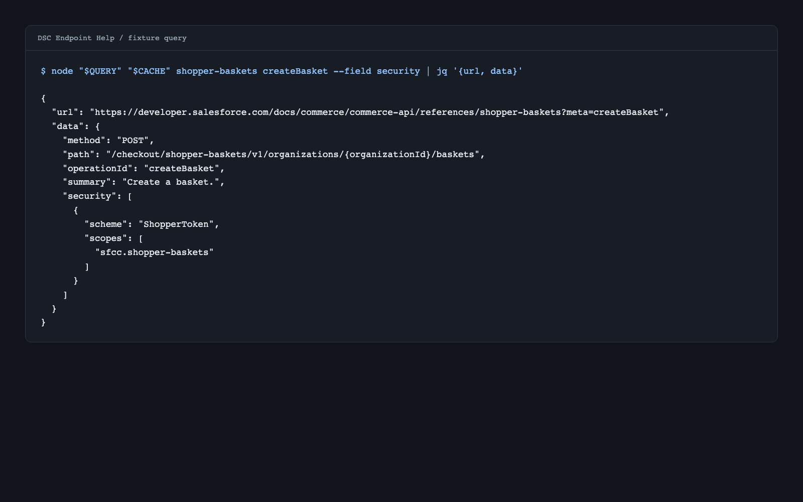

# agent-skills

Portable [Agent Skills](https://agentskills.io/specification) that help coding agents navigate Salesforce developer documentation, write narrated Bash demonstrations, and guide GitHub contributions. Install them as self-contained plugins for Codex or Claude Code, or load the same skills directly in OpenCode.

## Install

Add this repository's marketplace once, then install one or more independent plugins:

| Plugin | Skills | Use it for |
|---|---|---|
| [`dsc`](plugins/dsc/) | `dsc-endpoint-help`, `dsc-scenario`, `dsc-scrape` | Answering and diagnosing Salesforce API reference questions, building multi-call scenarios, and scraping references into structured JSON |
| [`fork-and-pr`](plugins/fork-and-pr/) | `fork-and-pr` | Guiding a contributor through a GitHub fork, branch, commit, push, and pull request |
| [`stepped-demo-script`](plugins/stepped-demo-script/) | `stepped-demo-script` | Authoring paste-and-run Bash walkthroughs with narration, pauses, expectations, and cleanup |

### Codex CLI

```bash
codex plugin marketplace add https://github.com/j-256/agent-skills.git

codex plugin add dsc@portable-agent-skills
codex plugin add fork-and-pr@portable-agent-skills
codex plugin add stepped-demo-script@portable-agent-skills
```

Install only the plugins you want, then start a new Codex session. You can also browse configured marketplaces and install interactively with [`/plugins`](https://developers.openai.com/codex/plugins); the Codex IDE extension does not support plugins.

### Claude Code

```bash
claude plugin marketplace add https://github.com/j-256/agent-skills.git --scope user

claude plugin install dsc@portable-agent-skills --scope user
claude plugin install fork-and-pr@portable-agent-skills --scope user
claude plugin install stepped-demo-script@portable-agent-skills --scope user
```

Install only the plugins you want, then start a new session or run `/reload-plugins` if the install summary requests it.

### OpenCode

OpenCode loads the skills from a persistent local checkout rather than the plugin manifests:

```bash
git clone https://github.com/j-256/agent-skills.git agent-skills
```

Add the directories for the plugins you want to `skills.paths` in `~/.config/opencode/opencode.json`:

```json
{
  "$schema": "https://opencode.ai/config.json",
  "skills": {
    "paths": [
      "/absolute/path/to/agent-skills/plugins/dsc/skills",
      "/absolute/path/to/agent-skills/plugins/fork-and-pr/skills",
      "/absolute/path/to/agent-skills/plugins/stepped-demo-script/skills"
    ]
  }
}
```

Merge the selected entries into any existing array, keep the checkout in place, and restart OpenCode.

Every root `skills/<name>/` directory is also a self-contained package for clients that install individual skills. The [distribution guide](docs/distribution.md) covers local marketplaces, private and SSO-protected remotes, sparse checkout for one skill, authentication checks, and updates.

## Salesforce developer docs without the scavenger hunt

A typical Salesforce API question can require digging through rendered HTML, embedded `refList` data, several specification formats, and inconsistent authentication behavior. The DSC skills turn that work into structured answers and runnable plans, with every factual answer citing a public `developer.salesforce.com` URL that can be forwarded downstream.

### Pick the DSC skill by intent

| You need to... | Skill |
|---|---|
| Understand one endpoint's scopes, parameters, body, response, or a failing request | `dsc-endpoint-help` |
| Find prerequisite calls, follow IDs between operations, and produce runnable cURL | `dsc-scenario` |
| Fetch a catalog, reference, operation, or type as normalized JSON | `dsc-scrape` |

`dsc-endpoint-help` and `dsc-scenario` populate the shared cache on a miss, so most users do not need to invoke `dsc-scrape` first.

### Why the auth answers hold up

The machine-readable specs describe intended security, but they do not always capture observed enforcement. The DSC auth model is grounded in calls against a live B2C Commerce sandbox and encoded as deterministic routing:

- Runtime-tested details cover token hosts, tenant-qualified scopes, grant flows, request shapes, and API-plane boundaries that the specs omit or describe incompletely
- Each target receives the lightest sufficient auth tier, with the branch, token URL, and request shape rendered from metadata rather than selected ad hoc
- Curated corrections record the spec field they override and stop applying when that source field changes, surfacing a re-verification request instead of silently trusting stale behavior

The [Commerce authentication matrix](plugins/dsc/docs/commerce-auth-matrix.md) documents the API planes, OAuth grants, runtime observations, and correction model. The [DSC architecture guide](plugins/dsc/docs/dsc-skills.md) covers skill boundaries, parsing, caching, and extension points.

## See the skills in action

These are captured skill outputs, not hand-authored approximations:



- [Build a guest basket and reach `createOrder`](plugins/dsc/skills/dsc-scenario/examples/scenario-createorder-prereqs.md) with prerequisite ordering, least-privilege auth, and ID threading
- [Diagnose a 403 from a shopper JWT](plugins/dsc/skills/dsc-endpoint-help/examples/diff-jwt-scope-decode.md) by comparing decoded scopes and the request shape with the published operation
- [Demonstrate that `find -delete` is silent](plugins/stepped-demo-script/examples/demo-find-delete-no-prompt.md) with narration, visible expectations, and cleanup
- [Walk through a standard fork and pull request](plugins/fork-and-pr/examples/fork-and-pr-standard-flow.md) while pausing at user-controlled boundaries

Browse the complete [worked-example catalog](docs/examples/) for every captured output.

## Packaging

Canonical plugin sources live under [`plugins/`](plugins/). Each plugin includes portable, Codex, and Claude manifests plus every runtime file it needs. No npm install or build step is required for the shipped packages.

The root [`skills/`](skills/) directories are generated, self-contained copies for direct skill consumers. Each DSC skill carries its own synchronized runtime snapshot while sharing the on-disk cache at `~/.cache/dsc-scrape/`.

Repository-wide guidance starts in the [documentation index](docs/). Repository releases use [`VERSION`](VERSION), while each plugin keeps its own package version.

## Development

Start with [CONTRIBUTING.md](CONTRIBUTING.md) for setup, synchronization, validation, and pull-request guidance. The [`stream-eval`](https://github.com/j-256/stream-eval) harness provides adapter-backed trigger and synthesis evaluation for Claude Code, Codex, and OpenCode; its full reference lives in [`harness/README.md`](harness/README.md).

## License

[MIT](LICENSE)
